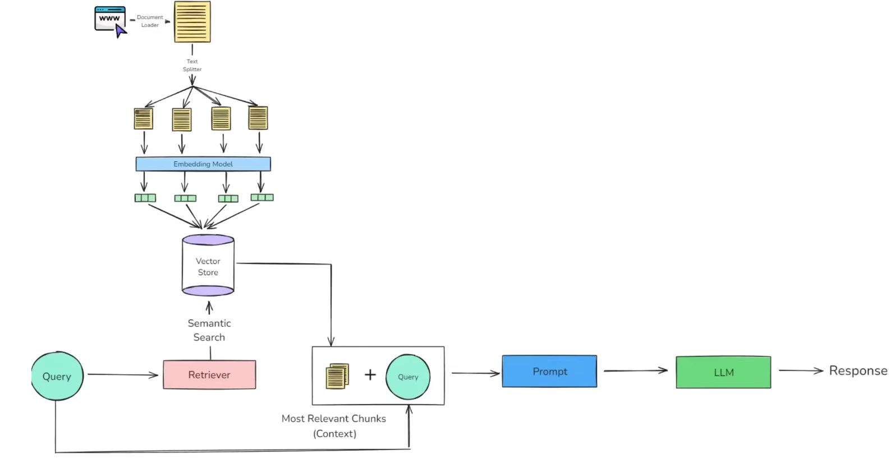

# 🧠 How Large Language Models (LLMs) Work

Large Language Models (LLMs) are trained on a massive amount of data — almost everything available on the internet 🌐. This includes:

- 📚 Books
- 🖥️ Websites
- 💬 Forums
- 📰 Articles
- 💻 Code

That’s why LLMs often feel like “they know everything.”  
But where is this knowledge actually stored?

---

## 📦 Where Is the Knowledge Stored?

LLMs store knowledge in their **parameters** — large sets of numbers 🔢.  
When we hear things like:

- 🤖 “This model has 7 billion parameters”
- 🚀 “GPT-4 has over 1 trillion parameters”

…it means that much **learned knowledge** is stored in the model.  
These are not facts stored directly, but **patterns** — this is called **parametric knowledge**.

> 🧠 Generally, **more parameters = more powerful understanding and reasoning**

---

## 🧭 How Do We Access This Knowledge?

We access an LLM’s knowledge by giving it a **prompt** ✍️ — basically, a question or query.

1. 🧠 Understands the **meaning** of the prompt (Natural Language Understanding)
2. 📡 Looks into its **parametric knowledge**
3. 🧾 Generates a **response word-by-word**, based on probabilities

💡 The output is **not fixed** — it is **probabilistic** 🔄. The model predicts the **most likely next word/token**, step-by-step.

> ⚠️ This means:
> - ❌ Not always 100% accurate
> - ✅ Tries to be contextually correct
> - ⚠️ Wrong answers may still sound confident

---

## ⚠️ Limitations of LLMs

Even though LLMs are powerful, they have important limitations:

---

### 🔒 1. No Access to Private or Unseen Data

- 🧠 LLMs only know what they were trained on
- 🔐 They **can’t access private files, emails, class notes, etc.**
- 🏗️ Like a house price model can’t predict car prices — LLMs can’t answer from domains they were never trained on

---

### 📅 2. Knowledge Cutoff & No Real-Time Awareness

- 📆 Most LLMs are trained up to a specific **knowledge cutoff date**
- ❌ So they **don’t know about recent events, news, or updates**

> But sometimes ChatGPT gives current info — how?

✅ That’s because tools like:

- 🌍 **Web Search**
- 📡 **APIs**
- 🔎 **Custom Retrieval Systems**

…are used to fetch updated data.  
This is similar to **RAG — Retrieval-Augmented Generation** (explained later 👇)

---

### 😵‍💫 3. Hallucinations (Confident But Wrong)

LLMs might generate **factually wrong info** — but still sound fully confident.  
This is called **hallucination**.

> ❓ *"Did Einstein play football in his childhood?"*  
> 🤖 *"Yes, he loved football and often played in Germany!"* ❌

⚠️ This is risky in critical areas like:

- 🏥 Healthcare
- ⚖️ Law
- 💰 Finance

---

### 📌 Other Limitations:

- 🧩 Struggles with complex logic/math
- 🧠 Biased outputs (depends on training data)
- 🕒 No long-term memory (in many models)
- 🔁 Can repeat or go off-topic in long conversations
- 🤷‍♂️ Doesn’t reason like humans

---

# 🛠️ Solutions to LLM Limitations

Now that we’ve seen the major limitations — let’s look at **practical solutions** to overcome them.

---

## 🔧 1. Fine-Tuning

**Fine-tuning** = Taking a pre-trained LLM and training it more on **your own domain data**.

📌 Simply put:
> “Teaching the model your data by giving it more examples”

---

### 🧠 Techniques of Fine-Tuning:

- **📘 Supervised Fine-Tuning**  
  Give model Q&A pairs to learn responses from your domain (legal, support, etc.)

  **Steps:**
  - 🗃️ Collect high-quality Q&A
  - 🧪 Use memory-efficient methods like **LoRA**, **QLoRA**
  - 🏋️ Train for a few epochs
  - 📊 Evaluate & test for safety

- **🧩 Unsupervised Fine-Tuning**  
  No labels required — model learns from raw text.

- **🧬 RLHF (Reinforcement Learning from Human Feedback)**  
  Uses human preferences to improve helpfulness, safety, honesty.

---

### ❗ Challenges in Fine-Tuning

- 💸 Expensive (needs GPUs/TPUs)
- 👨‍🔬 Requires ML expertise
- 🔁 Not ideal for frequently changing data

---

## 🧠 2. In-Context Learning (Few-Shot or Zero-Shot)

Instead of training the model, we give it **smart prompts** with examples.

📌 Example prompt:

> ❓ “Answer only using the provided context.  
> If the context is not enough, just say 'I don’t know.'”

✅ Helps reduce hallucinations  
❌ But only temporary — no memory or long-term retention

---

## 🧠💡 Game-Changer: RAG (Retrieval-Augmented Generation)

Fine-tuning and in-context learning are useful, but don’t scale well for changing data.

That’s where **RAG** comes in!

---

# 🔍🧠 What is RAG (Retrieval-Augmented Generation)?

RAG = **Information Retrieval + Text Generation**

It combines:

- 🔎 **Search systems** (fetch relevant knowledge)
- ✍️ **LLMs** (generate fluent responses)

---

---

## 🧩 4 Main Components of RAG

> RAG works in 4 core steps:

---

### 1️⃣ Indexing — *Preparing the Knowledge Base*

Make external data searchable efficiently.

#### ✅ Steps:

1. 📥 **Document Ingestion**  
   Load documents using tools like LangChain Document Loaders.

2. ✂️ **Text Chunking**  
   Split large docs into small chunks (using `TextSplitter`).

3. 🧠 **Embedding Generation**  
   Convert text chunks into vectors using embedding models (OpenAI, HuggingFace, etc.)

4. 🧺 **Vector Store Storage**  
   Save embeddings in vector databases like:
   - 🔸 FAISS
   - 🔹 Chroma
   - 🌲 Pinecone
   - 💠 Qdrant
   - 📦 Weaviate

---

### 2️⃣ Retrieval — *Finding Relevant Chunks*

When user sends a query, we retrieve matching chunks.

#### ✅ Steps:

1. 💬 Convert user query to vector (embedding)
2. 🔍 Search vector store using:
   - Cosine similarity
   - **MMR (Maximal Marginal Relevance)**
   - **Hybrid Search** (BM25 + Embeddings)
3. 🧱 Rank the closest chunks
4. 📄 Return top-k most relevant text chunks

---

### 3️⃣ Augmentation — *Adding Context to Prompt*

Now, combine user query + retrieved chunks:

> 🧠 Prompt = [User Query + Relevant Info]

This helps the model generate **accurate, grounded answers** and avoid hallucinations.

---

### 4️⃣ Generation — *LLM Creates the Answer*

Finally, the LLM responds using:

- 🔢 Its **own knowledge**
- 📄 Plus **retrieved context**

✅ Result = Fluent, contextual, grounded answer

---

## ✅ Summary

RAG bridges the gap between:

- Static LLMs (trained long ago)
- And dynamic, real-world data (your docs, notes, FAQs)

> 🔧 You don’t need to fine-tune the model or modify it — just update the **knowledge base**

---

---

**📄 Created by: Adarsha Rimal**
