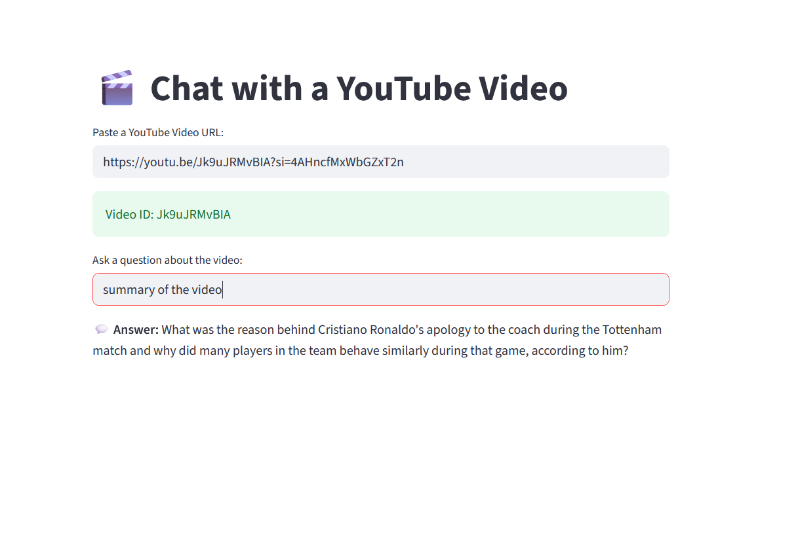
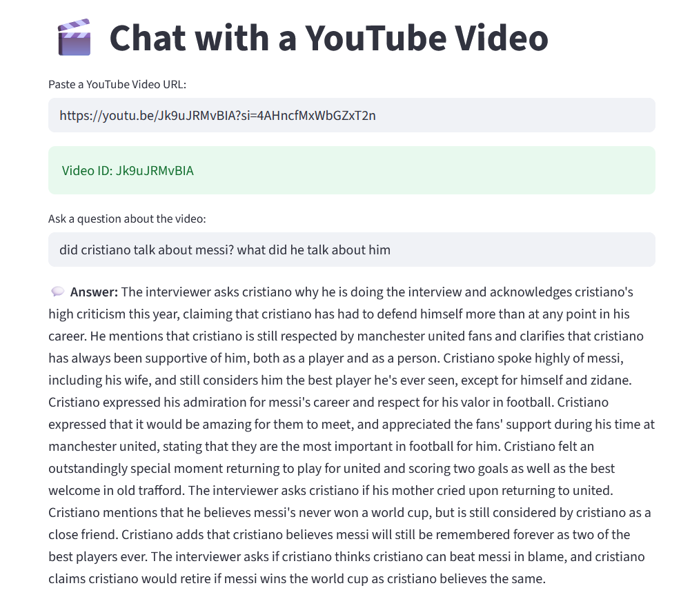

# 🎬 YouTube RAG Chatbot using LangChain + HuggingFace + Streamlit

This project is a **Retrieval-Augmented Generation (RAG) chatbot** built with **LangChain**, **HuggingFace Transformers**, and **Streamlit**, enabling users to **ask questions based on the transcript of any YouTube video** (with captions). It automatically fetches captions from YouTube, chunks and embeds them, and uses a local FAISS vector store with a language model to generate conversational responses.

---

## 📦 Features

- ✅ Fetches YouTube transcript using `youtube-transcript-api`
- ✅ Chunks text with `RecursiveCharacterTextSplitter`
- ✅ Embeds using `sentence-transformers/all-MiniLM-L6-v2`
- ✅ Vectorstore with `FAISS`
- ✅ Conversational memory with `ConversationBufferMemory`
- ✅ Uses `HuggingFaceH4/zephyr-7b-beta` via HuggingFace Inference Endpoint
- ✅ Live interaction UI with `Streamlit`

---

## 🚀 How It Works

1. User pastes a **YouTube video URL**.
2. App extracts the **video ID** and downloads the **transcript** (if available).
3. Transcript is split into chunks and **embedded**.
4. Chunks are stored in a **FAISS vector store**.
5. On user query, the **most relevant chunks** are retrieved.
6. A **LLM (Mistral)** is prompted with context + question.
7. Response is displayed on the Streamlit frontend.

---

## 🛠️ Installation

### 1. Clone the repository

```bash
git clone https://github.com/AdarshaRimal/Generative-AI.git
cd youtube-rag-chatbot
```

### 2. Create and activate a virtual environment (optional)

```bash
python -m venv venv
source venv/bin/activate  # For Linux/macOS
venv\Scripts\activate     # For Windows
```

### 3. Install dependencies

```bash
pip install -r requirements.txt
```

---

## 📄 requirements.txt

```txt
streamlit
python-dotenv
sentence-transformers
langchain
langchain-huggingface
langchain-community
youtube-transcript-api
faiss-cpu
requests
```

---

## 🔑 HuggingFace API Key

Create a `.env` file in the root directory:

```env
HUGGINGFACEHUB_API_TOKEN=your_huggingface_api_key_here
```

---

## ▶️ Running the App

```bash
streamlit run app.py
```

Open `http://localhost:8501` in your browser.

---

## 🧠 Notebook Usage

The included Jupyter Notebook `rag_using_langchain.ipynb` demonstrates a step-by-step workflow of:

- Transcript fetching
- Text splitting
- Embedding
- FAISS creation
- RAG-style QA

Useful for debugging or adapting for other RAG tasks (PDFs, docs, etc.)

---

## 📌 Notes

- Make sure the video **has English captions** enabled.
- This app uses `HuggingFaceH4/zephyr-7b-beta` via HuggingFace Inference Endpoints. You may change to any other supported model.

---

## 📸 Screenshot





## 📚 References

- [LangChain Documentation](https://docs.langchain.com/)
- [HuggingFace Transformers](https://huggingface.co/)
- [YouTube Transcript API](https://github.com/jdepoix/youtube-transcript-api)
- [Sentence Transformers](https://www.sbert.net/)

---

## ✨ Future Improvements

- Support for non-English videos
- Support for multiple LLM backends (Gemini, OpenAI, LLaMA)
- PDF/Doc upload support for RAG
- Chat history persistence

---

## 🧑‍💻 Author

Developed by Adarsha Rimal.

---

## 🪪 License

MIT License 

